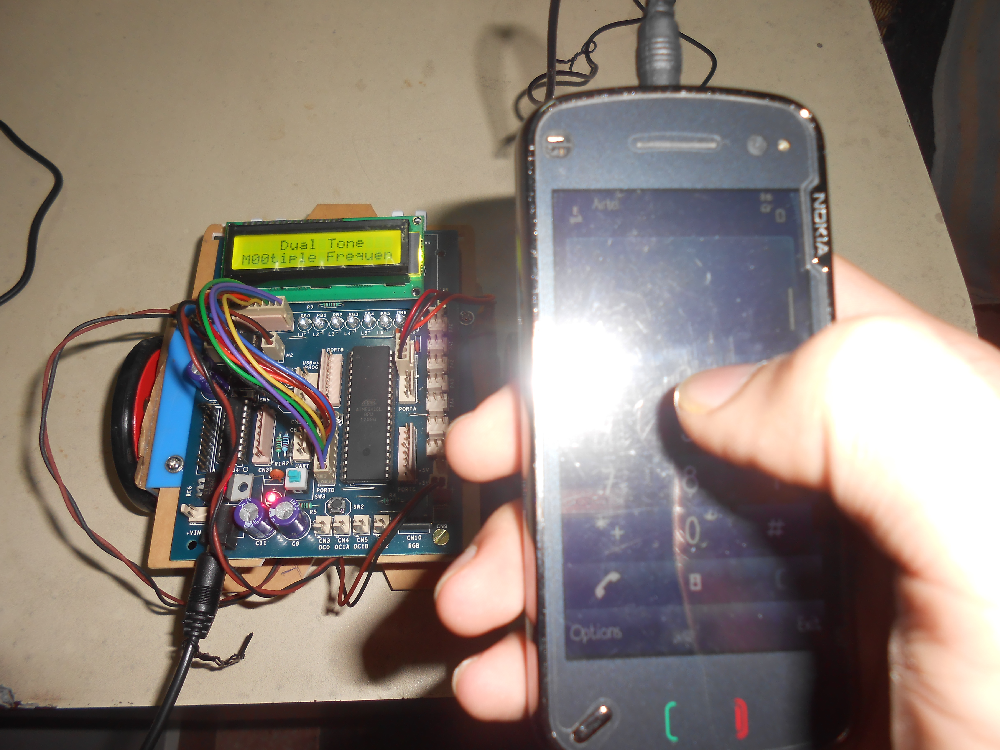

# Mobile Controlled Robot Based on Dual Tone Multi Frequency (DTMF)
- Developed a robot controlled by a mobile phone from anywhere around the world
- Incorporated various hardware such as a Microcontroller (ATMEGA 16), DC Motors, LCD, DTMF decoder
- Included circuit design and hardware programming in C
 

## Hardware Components:
- Micro-Controller: **ATMEGA 16**
- LED Matrix
- 16 x 2 LCD
- DC Motors
- DTMF
 

